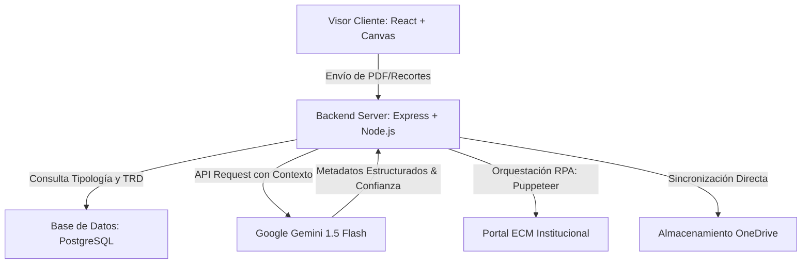

# PRESENTACIÓN: AUTOMATIZACIÓN INTELIGENTE DEL ARCHIVO ELECTRÓNICO
## Material de Exposición para Ponencia de 30 Minutos
---

## Diapositiva 1: Portada y Bienvenida
*   **Título Principal:** Automatización Inteligente del Archivo Electrónico: Agilidad, cumplimiento y preservación
*   **Subtítulo:** De horas de archivo repetitivo a segundos de clasificación inteligente
*   **Presentado por:** Equipo de Desarrollo Estrategia 180 / SENA
*   **Concepto Visual:** Fondo oscuro tecnológico, con el logo del SENA estilizado, luces de gradiente animadas en tonos verde institucional (Hex #39A900) y azul cian, íconos flotantes de un cerebro (Inteligencia Artificial) y un rayo (RPA / Automatización).
*   **Contenido de la Diapositiva:**
    *   Logotipo del SENA y marca del proyecto Automatización Inteligente del Archivo Electrónico.
    *   Propósito central: "Optimización operativa y liberación del talento humano a través de la hiperautomatización".
    *   Pilares del Proyecto:
        *   **Cognición:** IA generativa interpretando texto.
        *   **Acción:** Robots de software ejecutando procesos en el ECM/OneDrive.
        *   **Cumplimiento:** Respeto absoluto a las Tablas de Retención Documental (TRD).

---

## Diapositiva 2: El Desafío de la Gestión Documental Pública
*   **Título:** El Dolor de Hoy: Fricción en el Archivo Organizacional
*   **Subtítulo:** El impacto del crecimiento documental en las entidades del Estado
*   **Concepto Visual:** Una comparación visual: una silueta humana abrumada por una montaña de papeles digitales frente a un flujo limpio automatizado. Iconografía de advertencia en color rojo/naranja.
*   **Contenido de la Diapositiva:**
    *   **El Volumen Inmanejable:** Cada año se radican millones de folios en PDF (actas, contratos, resoluciones, peticiones) que requieren indexación manual estricta.
    *   **Normatividad Exigente:** El cumplimiento de las directrices del Archivo General de la Nación (AGN) obliga a un control milimétrico de las series, subseries y expedientes.
    *   **Puntos de Dolor Críticos:**
        *   *Fatiga Cognitiva:* El funcionario debe abrir, leer, interpretar e identificar la tipología de cada archivo individualmente.
        *   *Ineficiencia Manual:* Copiar y pegar metadatos (nombres, identificaciones, fechas, folios) manualmente desde el visor del PDF al formulario del sistema.
        *   *Inconsistencia:* Alta tasa de errores de digitación y clasificación que imposibilitan búsquedas posteriores eficientes.

---

## Diapositiva 3: La Fricción Operativa - Anatomía del Trabajo Repetitivo
*   **Título:** El Calvario del Copiar y Pegar
*   **Subtítulo:** ¿Por qué la indexación manual drena la productividad del funcionario?
*   **Concepto Visual:** Un flujograma paso a paso del calvario del usuario, ilustrando los clics y el tiempo desperdiciado en cada paso.
*   **Contenido de la Diapositiva:**

| Paso del Funcionario | Tarea Manual Realizada | Riesgo Asociado |
| :--- | :--- | :--- |
| **1. Recepción** | Descargar el PDF desde correo, OneDrive o buzón de radicados. | Duplicidad de archivos y pérdida de trazabilidad en bandejas de entrada. |
| **2. Lectura y Análisis** | Leer las primeras páginas del documento para deducir de qué trámite se trata. | Clasificación subjetiva errónea (ej. confundir un oficio con un derecho de petición). |
| **3. Acceso a Sistemas** | Abrir portales institucionales (ECM), superar credenciales corporativas (Microsoft SSO) y alertas de MFA. | Pérdida de tiempo por bloqueos de sesión o lentitud en el canal único de login. |
| **4. Digitación de Datos** | Transcribir letra a letra nombres de contratistas, números de cédula/NIT, fechas del documento y asuntos. | Errores de digitación que dañan la integridad del índice documental corporativo. |
| **5. Organización y Carga** | Crear manualmente la estructura de carpetas en OneDrive y arrastrar el archivo renombrado. | Nomenclatura inconsistente que rompe la estructura oficial de la TRD. |

---

## Diapositiva 4: Cuantificación del Dolor - La Calculadora de Tiempos
*   **Título:** Matemáticas de la Ineficiencia
*   **Subtítulo:** Cuantificando el costo y el desperdicio del tiempo operativo
*   **Concepto Visual:** Gráfico de barras comparativo (Manual vs. Robotizado) y un panel interactivo que muestra las variables de cálculo.
*   **Contenido de la Diapositiva:**
    *   **Variables Promedio Analizadas (Escenario Base):**
        *   *Documentos diarios por procesar:* 200 a 500 archivos por centro de formación.
        *   *Tiempo promedio manual por documento:* 4 minutos (Lectura, clasificación, login en portal, digitación, carga).
        *   *Tiempo promedio del robot por documento:* 15 segundos (Extracción automática de datos, login automatizado, digitación instantánea, API de carga).
    *   **Métricas del Escenario de 200 Documentos/Día:**
        *   **Tiempo Manual Acumulado:** 13.3 horas diarias de trabajo humano continuo.
        *   **Tiempo Automatizado Acumulado:** Solo 50 minutos del robot de software (sin fatiga).
        *   **Tiempo Recuperado para la Organización:** 12.5 horas diarias libres para que el personal realice análisis legal, atención al ciudadano o auditoría de calidad.
        *   **Ahorro Mensual Neto:** 250 horas de trabajo humano o 31 días laborales completos recuperados al mes.

---

## Diapositiva 5: Hiperautomatización: RPA + Inteligencia Artificial
*   **Título:** La Sinergia de Manos y Cerebro
*   **Subtítulo:** Fusionando Inteligencia Artificial con Robots de Software
*   **Concepto Visual:** Diagrama interactivo de bloques: El Cerebro (IA) se conecta al Brazo (RPA) para procesar un documento de entrada común.
*   **Contenido de la Diapositiva:**
    *   **¿Qué es la Automatización Tradicional (RPA)?**
        *   *Los Brazos:* Ejecuta tareas mecánicas predecibles. Hace clic en botones, escribe contraseñas y arrastra archivos.
        *   *La Limitación:* Es ciego. Si el formato del documento cambia o el texto está desorganizado, el robot tradicional falla catastróficamente.
    *   **¿Qué aporta la Inteligencia Artificial (IA)?**
        *   *El Cerebro:* Lee, comprende, razona y extrae. Interpreta PDFs complejos o imágenes escaneadas y predice su contenido.
    *   **La Hiperautomatización en la Automatización Inteligente del Archivo Electrónico:**
        *   La IA lee el PDF y estructura los metadatos (Nombres, Cédulas, Fechas).
        *   El Robot recibe estos datos limpios y los inyecta a toda velocidad en el ECM y OneDrive.
        *   **Resultado:** Un proceso dinámico que tolera cambios de formato y mantiene precisión quirúrgica.

---

## Diapositiva 6: Arquitectura Técnica de la Solución
*   **Título:** Detrás del Telón Tecnológico
*   **Subtítulo:** Componentes del ecosistema de hiperautomatización
*   **Concepto Visual:** Diagrama de arquitectura de software en 3 capas (Cliente, Servidor, Servicios Cognitivos).
*   **Contenido de la Diapositiva:**



*   **Puntos Fuertes de la Arquitectura:**
    *   *Frontend:* React optimizado con Tailwind CSS, interfaz responsiva de doble panel (Visor de PDF interactivo + panel de metadatos).
    *   *Backend:* Node.js asíncrono para gestionar múltiples procesos de extracción en paralelo sin bloqueos.
    *   *Modelos de Lenguaje:* Integración con la API de Gemini 1.5 Flash para garantizar baja latencia y alta precisión en comprensión lectora.

---

## Diapositiva 7: Clasificación Inteligente y Cumplimiento TRD
*   **Título:** Clasificación Cognitiva Basada en Contexto
*   **Subtítulo:** Cómo la IA aprende a respetar la TRD del SENA
*   **Concepto Visual:** Captura de la interfaz donde se ve la propuesta de clasificación con su respectivo porcentaje de confianza y justificación semántica.
*   **Contenido de la Diapositiva:**
    *   **El problema de las reglas rígidas:** Los sistemas antiguos buscan palabras clave ("contrato", "petición"). Si no están textualmente escritas, fallan.
    *   **La aproximación semántica de la Automatización Inteligente del Archivo Electrónico:** La IA lee el documento de manera integral y comprende la intención.
    *   **Características Clave del Motor de Clasificación:**
        *   *Sugerencia de Tipología:* Recomienda la serie o subserie adecuada según las Tablas de Retención Documental de la institución.
        *   *Nivel de Confianza (Confidence Score):* Muestra un porcentaje de certeza (ej. 98.5% seguro).
        *   *Razonamiento Explicado:* La IA redacta brevemente por qué tomó la decisión (ej. *"Invocación del Artículo 23 de la CP y solicitud explícita de copias médicas"*).
        *   *Control Humano:* El operador valida la decisión con un solo clic. La IA asiste, el funcionario supervisa.

---

## Diapositiva 8: Innovación en Usabilidad: OCR por Recorte Dinámico
*   **Título:** OCR Inteligente Interactivo
*   **Subtítulo:** Transcripción instantánea mediante clics sobre el PDF
*   **Concepto Visual:** Captura animada del usuario dibujando una caja de selección verde sobre un PDF y viendo cómo el campo de texto se llena automáticamente sin teclear.
*   **Contenido de la Diapositiva:**
    *   **El Desafío de los PDFs Digitalizados:** Muchos documentos son escaneados sin capa de texto oculta, haciendo imposible el copiar y pegar clásico.
    *   **La Solución: Canvas y OCR Dinámico:**
        *   El usuario simplemente dibuja un rectángulo con el ratón sobre cualquier parte del PDF (nombre, cédula, firma).
        *   El sistema recorta esa porción de imagen y la procesa en milisegundos usando capacidades multimodales de la IA.
    *   **Resolución de Problemas de Transparencia (Canal Alfa):**
        *   *El Problema:* Al recortar imágenes PNG/JPEG con fondo transparente en navegadores modernos, la transparencia se convertía en fondo negro, inutilizando el texto negro para el OCR.
        *   *La Solución:* Implementamos una inyección automática de canal alfa blanco sobre el canvas de renderizado del visor. Asegura legibilidad total y éxito del OCR.
        *   *Foco Inteligente:* El cursor salta al siguiente campo vacío de forma autónoma tras procesar el recorte anterior.

---

## Diapositiva 9: Estructura y Organización Simétrica en OneDrive
*   **Título:** Organización y Cumplimiento Normativo
*   **Subtítulo:** Sincronización directa y ordenada con la nube institucional
*   **Concepto Visual:** Estructura de carpetas limpia y anidada en un panel lateral emulando OneDrive, mostrando la ruta jerárquica exacta de la TRD.
*   **Contenido de la Diapositiva:**
    *   **Estandarización Total:** La automatización elimina la libertad del operador para nombrar carpetas de forma aleatoria (ej. *"carpeta_carlos"*, *"fotos_juan"*).
    *   **Jerarquización Jerárquica Automatizada:**
        ```
        [OneDrive Institucional]
           └── [Regional / Centro de Formación]
                 └── [Serie: 11-02 Comunicaciones Oficiales]
                       └── [Subserie: 11-02-05 Derechos de Petición]
                             └── [Expediente: 2026EX-035914]
                                   ├── 01_DERECHO_DE_PETICION.pdf
                                   ├── 02_ANEXO_CEDULA.pdf
                                   └── Hoja_de_Control_Digital.json
        ```
    *   **Políticas de Seguridad Implementadas:**
        *   *Nomenclatura Normada:* Nombres numerados de acuerdo al orden de radicación (01_Documento, 02_Documento).
        *   *Control de Duplicados:* Validación por Hash criptográfico para evitar que el mismo archivo se cargue dos veces al expediente.
        *   *Respaldos:* Copia espejo automática en almacenamiento seguro local ante fallas del canal de internet.

---

## Diapositiva 10: Retorno de la Inversión (ROI) y Beneficios Tangibles
*   **Título:** El Impacto del Cambio
*   **Subtítulo:** Resultados medibles en la operación documental de la entidad
*   **Concepto Visual:** Gráfico de torta mostrando la reducción de costos operativos y una lista de beneficios cualitativos resaltados.
*   **Contenido de la Diapositiva:**

| Métrica Analizada | Antes (Proceso Manual) | Ahora (Automatización Inteligente) | Beneficio Porcentual |
| :--- | :--- | :--- | :--- |
| **Tiempo de Procesamiento** | 10 Minutos / Documento | 15 Segundos / Documento | **97.5% Reducción de Tiempo** |
| **Tasa de Errores en Tipología** | ~ 25% de registros inconsistentes | < 0.2% de registros | **99.2% de Mayor Precisión** |
| **Tiempo en Login e Ingresos** | 45 segundos por sesión expirada | Automático mediante RPA y SSO | **Eliminación de fricción de login** |
| **Costo Operativo Directo** | Alto gasto de horas extra y retrasos | Costo de tokens IA mínimo (céntimos) | **Alta eficiencia presupuestal** |

*   **Beneficios Cualitativos:**
    *   *Descongestión:* Desocupación inmediata de bandejas de radicación acumuladas.
    *   *Funcionarios Felices:* Reducción drástica del estrés laboral y del túnel carpiano por digitación repetitiva.
    *   *Búsqueda Inmediata:* Expedientes 100% indexados y legibles desde cualquier terminal institucional.

---

## Diapositiva 11: Hoja de Ruta de Implementación Organizacional
*   **Título:** El Camino Hacia la Hiperautomatización
*   **Subtítulo:** Fases para desplegar con éxito la solución en la entidad
*   **Concepto Visual:** Una línea de tiempo horizontal con cuatro hitos clave bien espaciados.
*   **Contenido de la Diapositiva:**
    1.  **Fase 1: Diagnóstico y Mapeo de TRD (Semanas 1-2)**
        *   Auditoría de los formatos de documentos más recurrentes por centro de formación. Mapeo de códigos en base de datos.
    2.  **Fase 2: Instalación del Servidor y Conectores (Semanas 3-4)**
        *   Despliegue del backend Node.js en servidores institucionales y configuración de la API segura de Gemini con credenciales de protección de datos.
    3.  **Fase 3: Capacitación y Piloto Asistido (Semanas 5-6)**
        *   Entrenamiento de funcionarios de archivo para operar la interfaz interactiva. Corrida piloto con documentos reales controlados.
    4.  **Fase 4: Escalabilidad Total e Hiperautomatización Desatendida (Semana 7+)**
        *   Activación de robots RPA desatendidos para procesar radicaciones automáticas nocturnas sin intervención humana.

---

## Diapositiva 12: Cierre, Conclusiones y Preguntas
*   **Título:** El Futuro de la Gestión Pública Inteligente
*   **Subtítulo:** Empoderando al funcionario para la era del conocimiento
*   **Concepto Visual:** Panel centrado con una frase célebre destacada y detalles de contacto / agradecimientos en la parte inferior.
*   **Contenido de la Diapositiva:**
    *   *Reflexión Final:* **"La tecnología de Inteligencia Artificial no viene a reemplazar al funcionario público; viene a devolverle el tiempo de ser verdaderamente humano: analizar, decidir y servir con empatía."**
    *   **Conclusiones Clave del Proyecto:**
        *   La Automatización Inteligente del Archivo Electrónico une de forma práctica la visión científica de la IA con la pragmática operacional de los robots de software.
        *   Cumple al 100% con la normatividad legal de archivos en Colombia.
        *   Es una solución escalable y de bajo costo que puede replicarse en todas las regionales del país.
    *   **Espacio Abierto para Preguntas del Auditorio**
        *   *¿Cómo se maneja la seguridad de los datos personales?* (Encriptación en reposo y API privada enterprise).
        *   *¿Qué nivel de entrenamiento requiere el funcionario?* (Curva de aprendizaje de solo 30 minutos).
